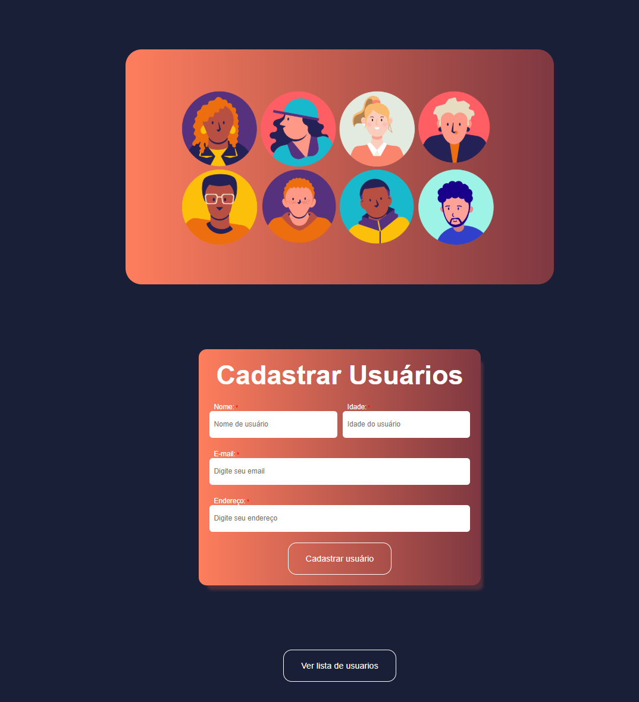
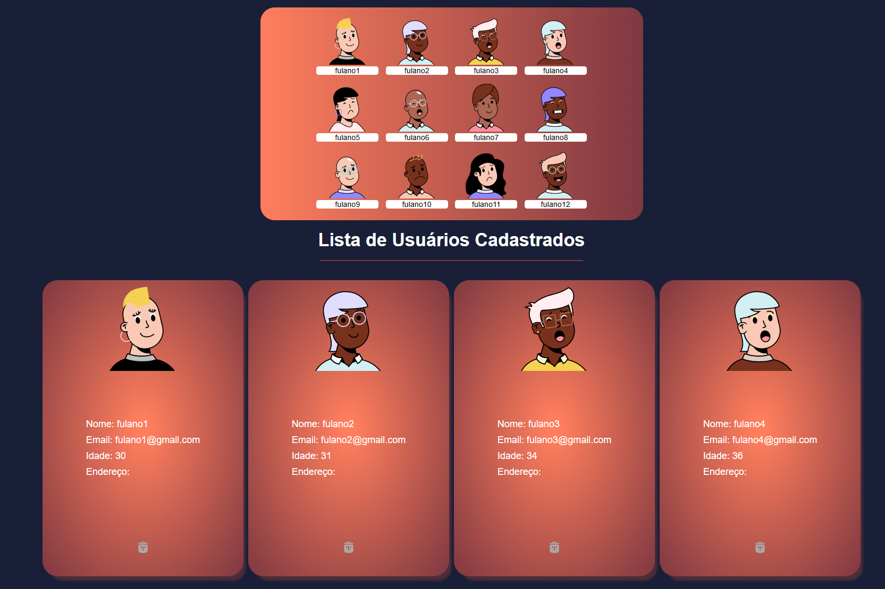

# DevUser 🧑‍💻

---

🧑‍💻 Sobre o DevUser
DevUser é uma aplicação web simples e intuitiva desenvolvida com foco no cadastro e gerenciamento de usuários. Criada com o objetivo de praticar e demonstrar habilidades em desenvolvimento full stack, a aplicação simula um sistema básico de CRUD (Create, Read, Update, Delete) — essencial para diversos tipos de sistemas reais.

Essa aplicação foi desenvolvida com tecnologias modernas e boas práticas, sendo ideal tanto para fins de estudo quanto como base para projetos maiores.

---

⚙️ Funcionalidades
Cadastro de novos usuários

Visualização da lista de usuários cadastrados

Edição de informações de usuários

Exclusão de registros

Feedback visual com alertas e confirmações

## Tecnologias

  
  
  

---

📌 Objetivo
O DevUser foi criado com foco em praticar conceitos fundamentais de aplicações web, como integração entre frontend e backend, manipulação de banco de dados e experiência do usuário com alertas interativos. Simples, direto e funcional.

## Imagens

---

## 🤝 **Agradecimentos e Contribuições**

**Quero agradecer a uma das maiores escolas do Brasil para Desenvolvedore(a) que é o DevClub**

**E também muito obrigado a todos que fazem o DevClub pela contruibuiçoes no desenvolvimento desse projeto**
